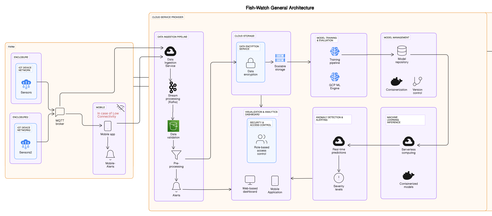
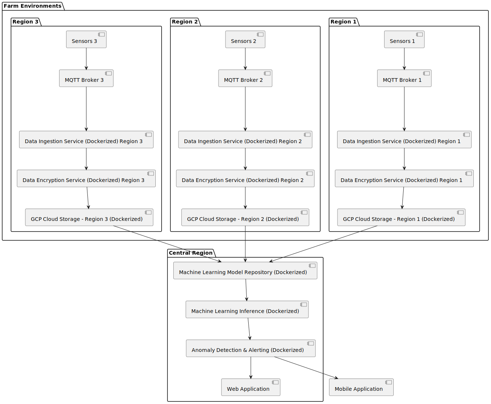
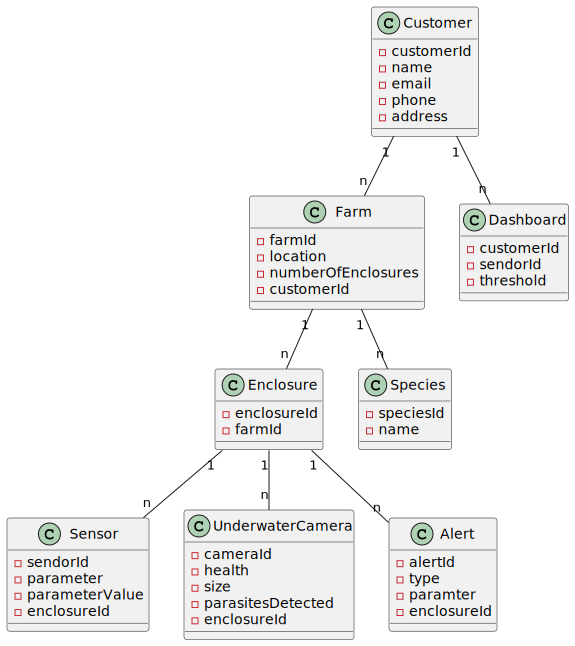

# FishWatch Software Architecture

## 1. General Architecture

Our system is designed to cater to the needs of monitoring and managing industrial equipment in remote farm areas, where connectivity can be unreliable or non-existent. By leveraging IoT sensors, cloud-based services, and machine learning, we aim to provide real-time insights, anomaly detection, and predictive maintenance capabilities for enhanced operational efficiency and reduced downtime.

## 2. System Overview

The system architecture comprises several interconnected components working cohesively to collect, process, store, analyze, and act upon data generated by industrial equipment. The key components include:

- **IoT Sensors:** Attached to industrial equipment for real-time data collection (e.g., temperature, vibration, pressure).
- **MQTT Broker:** Facilitates communication between IoT devices and cloud services, ensuring scalability, encryption, and authentication.
- **Data Ingestion Service:** Subscribes to the MQTT broker, ingests data, and forwards it to Kafka for stream processing.
- **Kafka:** Handles high-volume data streams efficiently, facilitating stream processing, validation, and preprocessing.
- **Data Encryption Service:** Encrypts data for privacy during transit and storage.
- **GCP Cloud Storage:** Provides reliable, scalable, and cost-effective data persistence.
- **Web Dashboard:** Enables users to visualize data with role-based access control, ensuring privacy and security.
- **Machine Learning Model Repository:** Stores trained models for equipment types and failure scenarios, facilitating version control, deployment, and scaling.
- **Training Pipeline:** Allows data scientists to train and evaluate models using historical data and domain expertise, with support for online learning techniques.
- **Machine Learning Inference:** Utilizes serverless computing platforms for real-time predictions based on incoming data streams, leveraging containerized models for scalability and flexibility.
- **Anomaly Detection & Alerting:** Compares real-time predictions to predefined thresholds or historical baselines, generating alerts routed to designated personnel for maintenance action.

## 3. Detailed Architecture

### 3.1 Data Collection and Ingestion

IoT sensors collects real-time data such as temperature, pH, and pressure, which is transmitted to the MQTT (Message Queuing Telemetry Transport) broker, capable of scaling to connect with millions of IoT devices. MQTT broker ensures message encryption using TLS and client authentication using modern protocols like OAuth.
In the absence of connectivity, mobile devices can subscribe to the MQTT broker and publish data to the Data Ingestion Service when connected. The Data Ingestion Service subscribes to the MQTT broker and forwards data to Kafka for stream processing.

### 3.2 Data Processing and Storage

In Kafka, data undergoes stream processing, validation, and preprocessing. Preprocessing techniques such as data normalization and feature engineering prepare data for analysis. Encrypted data is then stored in GCP Cloud Storage, ensuring reliability, scalability, and cost-effectiveness.

### 3.3 User Interface and Access Control:
- A Web Dashboard allows users to view data securely, implementing Role-Based Access Control to ensure customers only access data from their farms.

### 3.4 Machine Learning Model Management

The Machine Learning Model Repository stores trained models for various equipment types and failure scenarios. Version control enables easy rollbacks and deployment of improved models. Containerization technologies facilitate model deployment and scaling, while a separate training pipeline allows data scientists to train and evaluate new models using historical data and domain expertise. Online learning techniques enable models to adapt to changing operational conditions over time.

### 3.5 Machine Learning Inference

Real-time predictions are triggered by a serverless computing platform based on incoming data streams. Containerized models are invoked for real-time prediction or batch processing for historical data analysis.

### 3.6 Anomaly Detection & Alerting

Real-time predictions are compared to predefined thresholds or historical baselines to identify potential equipment anomalies. Alerts are generated and routed to designated personnel for maintenance action, with support for SMS and email integrations. Severity levels can be assigned based on the predicted probability of failure.

## 4. Deployment:

- Services are deployed in regions close to farms, ensuring low latency and high availability.
- A centralized service aggregates data from multiple farms across different geographies, creating a multi-region application to serve distributed audiences effectively.

## 5. Entity Relationship:

## 6. Conclusion

Our system architecture provides a comprehensive solution for monitoring and managing industrial equipment in remote farm areas. By leveraging IoT, cloud-based services, and machine learning, we ensure real-time insights, anomaly detection, and predictive maintenance capabilities, thereby enhancing operational efficiency and reducing downtime.